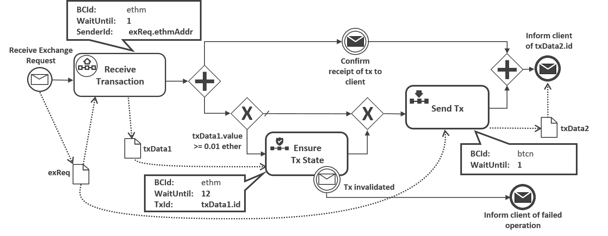
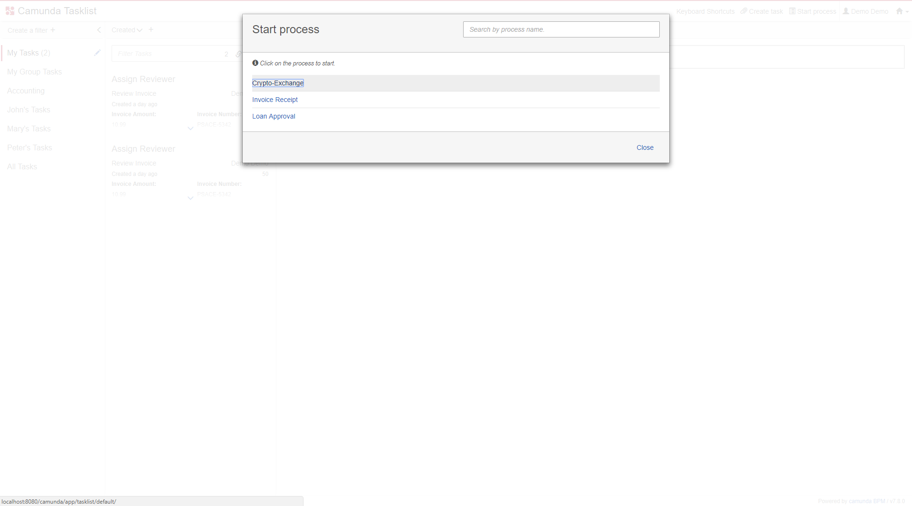
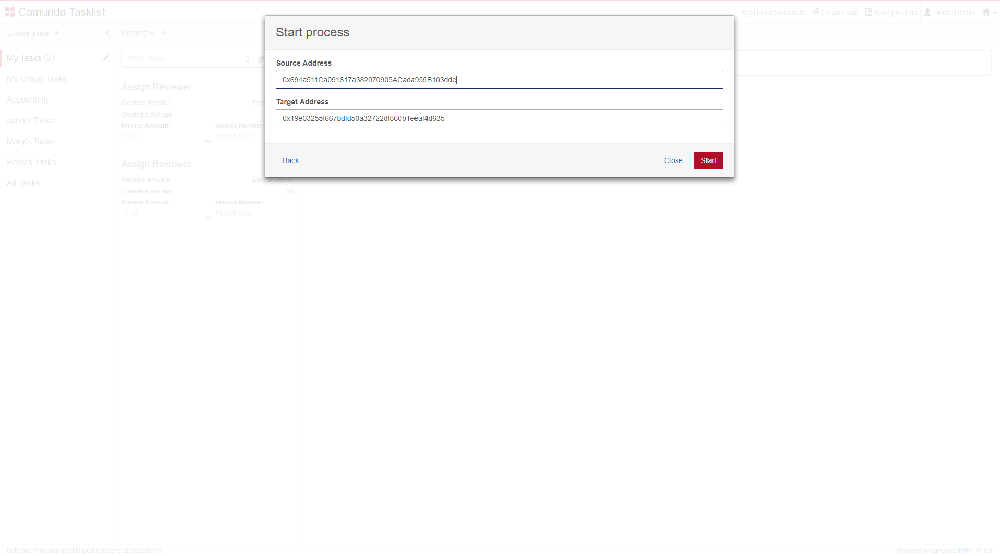
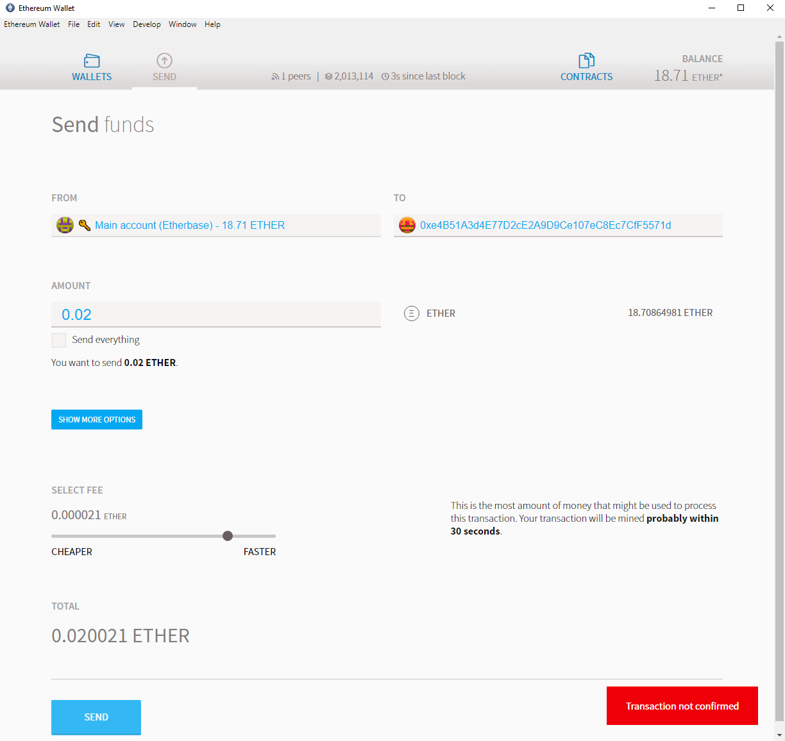
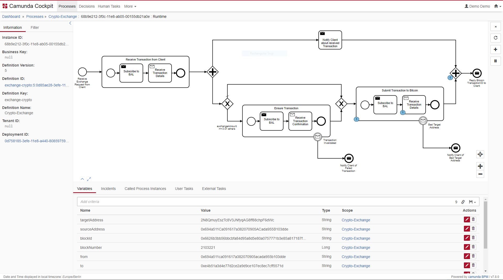
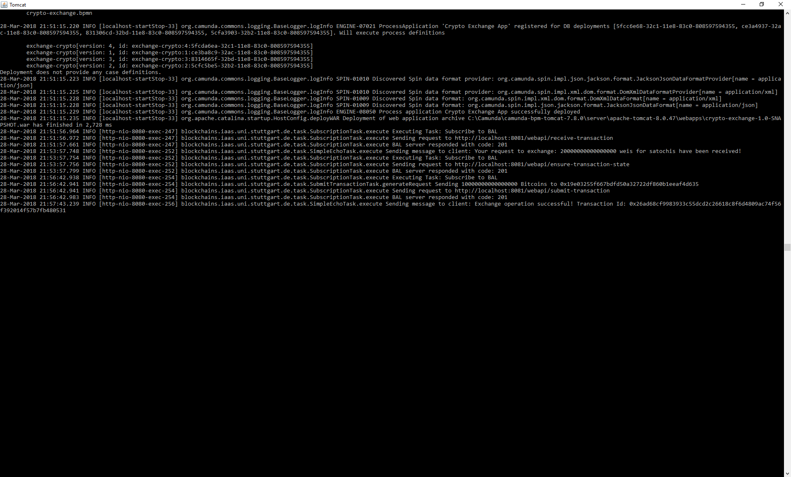
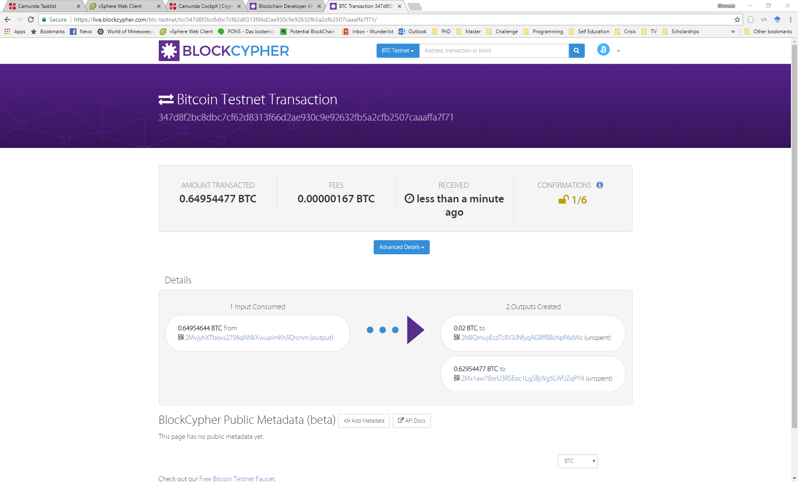

# Blockchain Access Layer
The project is a Java 8 web application that uses Jersey to expose a RESTful API.

## Configuration
The blockchain access layer needs to be able to communicate with a [geth node](https://github.com/ethereum/go-ethereum)
which has RPC connections enabled.
Furthermore, the layer directly accesses the keystore file holding the private key of an Ethereum account used for sending
and receiving transactions.
On the other hand, the BAL also needs to be able to communicate with a [bitcoind node](https://bitcoin.org/en/bitcoin-core/)
which has RPC connections enabled.
The configuration file that can be used to configure these aspects (communication with a geth, and a bitcoind nodes and the local Ethereum keystore) can be found 
[here](src/main/resources/config.properties)


## Building and Deployment
After cloning, you can build the project and package it into a WAR
file using the following command:
```
mvn install
```
Then, the WAR file (which can be found in the folder 'target' generated after 
a successful build) can be deployed on an Apache Tomcat server.

**Notice:** the build requires a library (btcd-cli4j) to communicate with the Bitcoin Core node. [The used library](https://github.com/pythonmax/btcd-cli4j)
is forked from an [unmaintained library](http://btcd-cli4j.neemre.com) to fix some issues resulting from changes in the recent versions
of the Bitcoin Core node. However, the used library is not available in a public Maven repository, so we had to provide
a local Maven repository which includes the required binaries. This repository is found [here](local-maven-repo).

## Accessing the API
The application exposes an asynchronous RESTful API to subscribe and unsubscribe from the provided operations.

**To summarize:**
The RESTful api provides the following resources/methods: 
* A POST method is provided for each of the following
paths to create the corresponding subscription:

```
{application-URL}/webapi/submit-transaction
{application-URL}/webapi/receive-transaction
{application-URL}/webapi/receive-transactions
{application-URL}/webapi/detect-orphaned-transaction
{application-URL}/webapi/ensure-transaction-state
```

* A GET method is also provided for the aforementioned URLs that lists the currently active subscriptions.

* A DELETE method is provided in each of the following
paths to manually delete the corresponding subscription:

```
{application-URL}/webapi/submit-transaction/{subscription-id}
{application-URL}/webapi/receive-transaction/{subscription-id}
{application-URL}/webapi/receive-transactions/{subscription-id}
{application-URL}/webapi/detect-orphaned-transaction/{subscription-id}
{application-URL}/webapi/ensure-transaction-state/{subscription-id}
```

## Running a Local geth Node
A geth node is used to access the Ethereum network. For development purposes, it is advised
not to connect to the main Ethereum network, but rather to one of the testnets.
(another, more difficult option would be to run a local private Ethereum network).
In order to connect a geth node to [Rinkeby](https://www.rinkeby.io) (one of Ethereum testnets), you can follow these steps:

1. [Install geth](https://github.com/ethereum/go-ethereum/wiki/Installing-Geth):
 this differs depending on your operating system.
2. Run geth in the fast-sync mode: This option downlaoads the whole blockchain but does not re-execute all transactions. Syncing
the whole testnet blockchain (which is done once only) takes about 1-4 hours (depending on the hardware, the speed of the network 
connection, and the availability of peers).
To start a geth node in the fast-sync mode, execute the following command:
    ```
    geth --rpcapi personal,db,eth,net,web3 --rpc --rinkeby --cache=2048 --rpcport "8545"
    --bootnodes=
    enode://a24ac7c5484ef4ed0c5eb2d36620ba4e4aa13b8c84684e1b4aab0cebea2ae45cb4d375b77eab56516d34bfbd3c1a833fc51296ff084b770b94fb9028c4d25ccf@52.169.42.101:30303,
    enode://343149e4feefa15d882d9fe4ac7d88f885bd05ebb735e547f12e12080a9fa07c8014ca6fd7f373123488102fe5e34111f8509cf0b7de3f5b44339c9f25e87cb8@52.3.158.184:30303,
    enode://b6b28890b006743680c52e64e0d16db57f28124885595fa03a562be1d2bf0f3a1da297d56b13da25fb992888fd556d4c1a27b1f39d531bde7de1921c90061cc6@159.89.28.211:30303
    ``` 
    If you want your node to be accessible remotely, apart from configuring your firewall, you also need to use the following extra option,
 when running the node: ```--rpcaddr "0.0.0.0"```
3. Test connection: you can test your connection to a running geth node using the following command
(make sure to install geth on the computer where you run this command):```geth attach http://localhost:8545```
please replace _localhost_ with the ip address of the computer running the node.

## Running a Local Bitcoin Core Node
A Bitcoin Core node (or _bitcoind_ node) is used to access the Bitcoin network. For development purposes, it is advised
not to connect to the main Bitcoin network, but rather to one of the testnets.
(another, more difficult option would be to run a local private Bitcoin network).
In order to connect a _bitcoind_ node to [testnet3](https://en.bitcoin.it/wiki/Testnet) (one of Bitcoin's testnets), you can follow these steps:

1. [Install bitcoind](https://bitcoin.org/en/download):
 this differs depending on your operating system. For the installation instructions on Ubuntu you can follow [these steps](https://gist.github.com/rjmacarthy/b56497a81a6497bfabb1).
2. Configure _bitcoind_: This can be done by editing the bitcoin.conf file. The configuration file we used can be found [here](src/main/resources/bitcoin.conf).
The configuration allows external rpc-based communication with the node, and instructs it to communicate with the testnet rather than
the mainnet. Furthermore, it orders the node to build an index on the blockchain that allows querying even historic transactions. Finally, it instructs the node
to send notifications to the BAL when it detects a new block or a transaction addressed to one of the Bitcoin wallet's addresses.
Syncing the whole testnet blockchain (which is done once only) takes about 1-4 hours (depending on the hardware, the speed of the network 
connection, and the availability of peers).
3. Start the pre-configured _bitcoind_ node with the following command:```bitcoind -daemon```
4. Test connection: you can test your connection to a running _bitcoind_ node using the following command
(make sure to install bitcoin-cli (shipped with _bitcoind_) on the computer where you run this command):
```
bitcoin-cli -getinfo -rpcconnect=<ip address of the node> -rpcport=<port of the node> -rpcuser=<rpc username> -rpcpassword=<rpc password>
```

## Case Study
The case study invloves a cryptocurrency exchange service utilitzing the blockchain access layer.
The exchange uses the following simplified BlockME-model:



Please follow these instructions:
1. Configure and run a local geth node (see above).
2. Configure and run a local bitcoind node (see above).
3. Configure the blockchain access layer to communicate with this node and to read a valid Ethereum keystore file (see above)
4. Build and deploy the blockchain access layer (see above).
5. Configure, build, deploy and initiate the process model ([see this Github repository for instructions](https://github.com/ghareeb-falazi/BlockME-UseCase))
6. Send ethers to the address maintained by the blockchain access layer (the first address of the keyfile mentioned in step 3).
7. Monitor the Tomcat server logs for both applications to see the progress. You can also use the 
Camunda Cockpit application (installed as part of step 4) to monitor the current state of instances of deployed process models.

The following series of screenshots show a sample execution of the case study:

 1. Initiating the process instance:
 
 
 2. Setting the source, and target addresses (exchange request parameters):
 
 
 3. Sending a transaction to the address of the crypto-exchange using the Ethereum Wallet application:
 
 
 4. While waiting for the resulting Bitcoin transaction sent to the client to receive 1 confirmation, the business process instance looks
 as follows:
 
 
 5. The log records produced by the process instance. The final message in the log shows the id of the transaction
 the exchange sent to the client.
 
  
 6. [BlockCypher](https://live.blockcypher.com/btc-testnet/) can be used to explore Bitcoin testnet3 (and other) blockchains.
 The following screenshot represents the result of querying the transaction id reported in the previous step:
 
You can find the details about the resulting testnet3 Bitcoin transaction [here](https://live.blockcypher.com/btc-testnet/tx/347d8f2bc8dbc7cf62d8313f66d2ae930c9e92632fb5a2cfb2507caaaffa7f71/).
 
 When we performed this sample execution, the setup was as follows:
 
* a _geth_ node is running on a virtual machine in a VSphere accessible from the local network.
* a _bitcoind_ (Bitcoin Core) node is running on a virtual machine in a VSphere accessible from the local network.
* The blockchain access layer is running in a local Tomcat server listening to port 8081
* The camunda engine is running in a local Tomcat server litening to port 8080