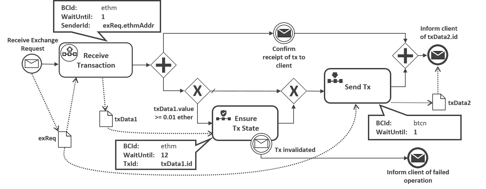
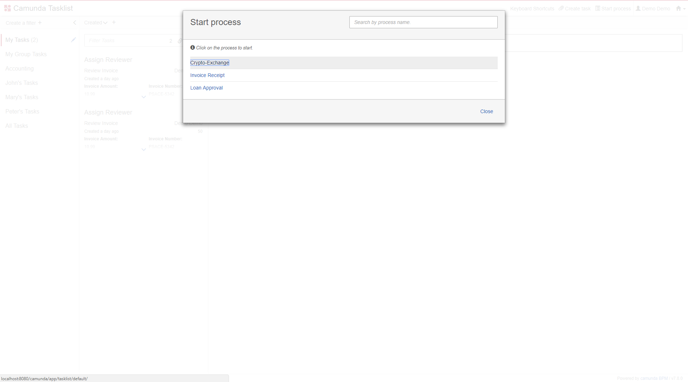
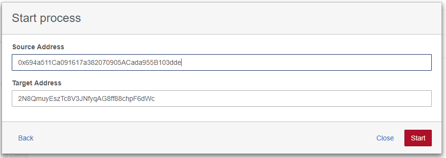
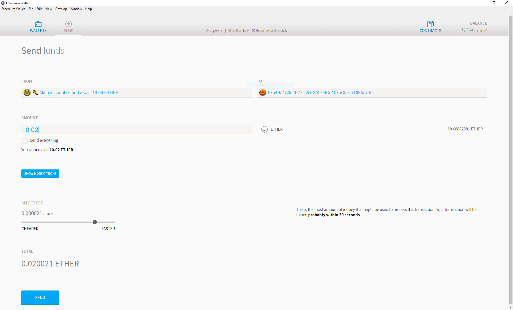
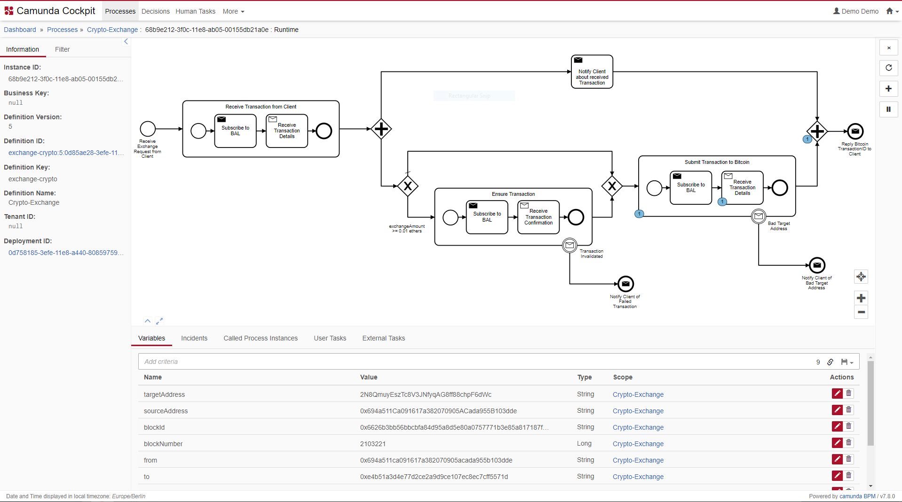
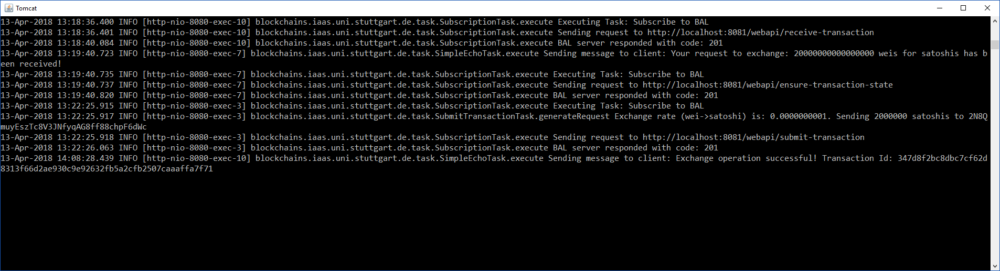
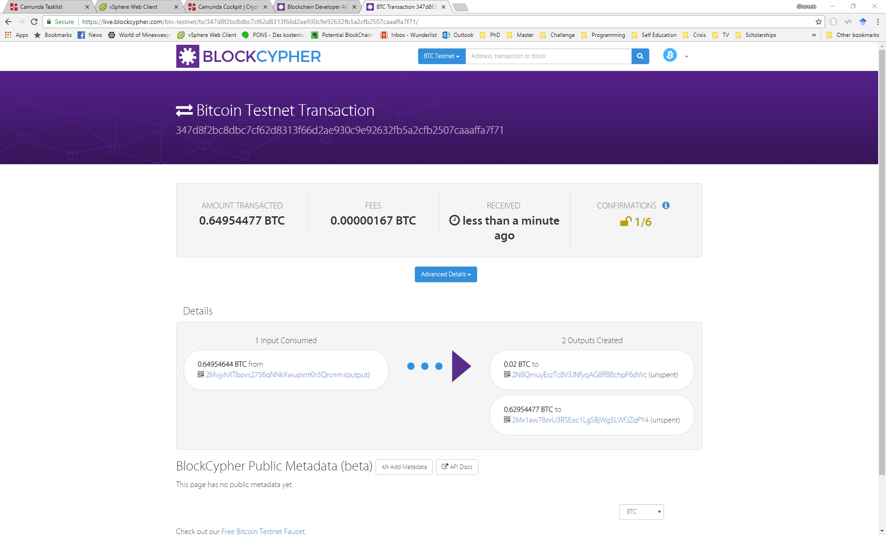

# Blockchain Access Layer (BAL) - SCIP Gateway

BAL is an extensible abstraction layer that allows client applications to access permissioned and permissionless
blockchains using a uniform interface. BAL is designed to support business process management systems to access
blockchains using
the [Blockchain Modeling and Execution (BlockME) method](https://link.springer.com/article/10.1007/s00450-019-00399-5).
It also implements the [Smart Contract Invocation Protocol (SCIP)](https://github.com/lampajr/scip) as a gateway.

BAL is a Java 8 web application that uses Jersey to expose a [RESTful API](#restful-api) and
a [JSON-RPC API](#json-rpc-api).

## Configuration

BAL allows simultaneous access to multiple blockchain systems. Currently, [Ethereum](https://ethereum.org/)
, [Bitcoin](https://bitcoin.org/), and [Hyperledger Fabric](https://www.hyperledger.org/projects/fabric) are supported.

- To access the Ethereum blockchain, BAL needs to be able to communicate with
  a [geth node](https://github.com/ethereum/go-ethereum)
  which has RPC connections enabled. Furthermore, BAL directly accesses the keystore file holding the private key of an
  Ethereum account used for sending and receiving transactions.
- To access the Bitcoin blockchain, BAL needs to be able to communicate with
  a [bitcoind node](https://bitcoin.org/en/bitcoin-core/)
  which has RPC connections enabled.
- To access a given Hyperledger Fabric network, it needs to have access to a wallet file with authorized users, and an
  appropriate [connection profile](https://hyperledger-fabric.readthedocs.io/en/latest/developapps/connectionprofile.html)
  .

### Configuring Access to Multiple Blockchains

BAL expectes a configuration file with the name `connectionProfiles.json` inside the path `[User Folder]/.bal/`. An
example for this file that accesses a geth node, a bitcoind node and a Hyperledger Fabric network is:

```[json]
{
  "eth-0": {
    "@type": "ethereum",
    "nodeUrl":"http://localhost:7545",
    "keystorePath":"C:\\Ethereum\\keystore\\UTC--2019-05-30T11-21-08.970000000Z--90645dc507225d61cb81cf83e7470f5a6aa1215a.json",
    "keystorePassword":"123456789",
    "adversaryVotingRatio": 0.2,
    "pollingTimeSeconds": 2
  },
  "btc-0" : {
    "@type": "bitcoin",
    "rpcProtocol": "http",
    "rpcHost": "129.69.214.211",
    "rpcPort": "8332",
    "rpcUser": "falazigb",
    "rpcPassword": "123456789",
    "httpAuthScheme": "Basic",
    "notificationAlertPort": "5158",
    "notificationBlockPort": "5159",
    "notificationWalletPort": "5160",
    "adversaryVotingRatio": "0.1"
  },
  "fabric-0" : {
    "@type": "fabric",
    "walletPath": "C:\\Users\\falazigb\\Documents\\GitHub\\fabric\\fabric-samples\\emc\\javascript\\wallet",
    "userName": "user1",
    "connectionProfilePath": "C:\\Users\\falazigb\\Documents\\GitHub\\fabric\\fabric-samples\\first-network\\connection-org1.json"
  }
}
```

## Building and Deployment

After cloning, you can build the project and package it into a WAR file using the following command:

```
mvn install
```

Then, the WAR file (which can be found in the folder 'target' generated after a successful build) can be deployed on an
Apache Tomcat server.

Required VM options while running

- `pf4j.pluginsDir` path where the plugins will be stored

## Plugin management

The project uses pf4j framework for managing the plugins. The application exposes RESTful APIs to:

- Upload the plugins as jar
- Remove plugins
- Get list of plugins with status
- Start plugin
- Disable plugin

### Supported plugins

- [Ethereum](https://github.com/TIHBS/blockchain-access-layer-ethereum-plugin)
- [Bitcoin](https://github.com/TIHBS/blockchain-access-layer-bitcoin-plugin)
- [Fabric](https://github.com/TIHBS/blockchain-access-layer-fabric-plugin)

**Notice:** the build requires a library (btcd-cli4j) to communicate with the Bitcoin Core
node. [The used library](https://github.com/pythonmax/btcd-cli4j) is forked from
an [unmaintained library](http://btcd-cli4j.neemre.com) to fix some issues resulting from changes in the recent versions
of the Bitcoin Core node. However, the used library is not available in a public Maven repository, so we had to provide
a local Maven repository which includes the required binaries. This repository is found [here](local-maven-repo).

## Accessing the APIs

### RESTful API

The application exposes an asynchronous RESTful API to subscribe and unsubscribe from the provided operations.

**To summarize:**
The RESTful api provides the following resources/methods:

* A POST method is provided for each of the following paths to create the corresponding subscription:

```
{application-URL}/webapi/submit-transaction
{application-URL}/webapi/receive-transaction
{application-URL}/webapi/receive-transactions
{application-URL}/webapi/detect-orphaned-transaction
{application-URL}/webapi/ensure-transaction-state
{application-URL}/webapi/invoke-smart-contract-function
```

* A GET method is also provided for the aforementioned URLs that lists the currently active subscriptions.

* A DELETE method is provided in each of the following paths to manually delete the corresponding subscription:

```
{application-URL}/webapi/submit-transaction/{subscription-id}
{application-URL}/webapi/receive-transaction/{subscription-id}
{application-URL}/webapi/receive-transactions/{subscription-id}
{application-URL}/webapi/detect-orphaned-transaction/{subscription-id}
{application-URL}/webapi/ensure-transaction-state/{subscription-id}
{application-URL}/webapi/invoke-smart-contract-function
```

#### Plugin management RESTful apis:


##### **POST** `/webapi/plugins/`

- Example

```bash
curl --location --request POST '{application-URL}/webapi/plugins/' \
--form 'file=@"<path>/blockchain-access-layer-ethereum-plugin-1.0.0.jar"'
```

##### **GET** `/webapi/plugins/`

- Example

```bash
curl --location --request GET '{application-URL}/webapi/plugins/'
```

##### **DELETE** `/webapi/plugins/{plugin-id}`

- Example

```bash
curl --location --request DELETE '{application-URL}/webapi/plugins/ethereum-plugin'
```

##### **POST** `/webapi/plugins/{plugin-id}/start`

- Example

```bash
curl --location --request POST '{application-URL}/webapi/plugins/ethereum-plugin/start'
```

##### **POST** `/webapi/plugin-manager/{plugin-id}/disable`

- Example

```bash
curl --location --request POST '{application-URL}/webapi/plugins/{ethereum-plugin}/disable'
```

##### **POST** `/webapi/plugin-manager/{plugin-id}/unload`

- Example

```bash
curl --location --request POST '{application-URL}/webapi/plugins/{ethereum-plugin}/unload'
```

##### **POST** `/webapi/plugin-manager/{plugin-id}/enable`

- Example

```bash
curl --location --request POST '{application-URL}/webapi/plugins/{ethereum-plugin}/enable'
```

### JSON-RPC API

BAL implements the [JSON-RPC binding](https://github.com/lampajr/scip#json-rpc-binding) described in the SCIP
specifications. It can be accessed with any
standard [JSON-RPC client](https://www.jsonrpc.org/archive_json-rpc.org/implementations.html).

## Setting Up Various Blockchains for Testing

BAL needs to have access to a node for each blockchain instance it needs to communicate with. These nodes can be already
running nodes that you have access to. Otherwise, you need to setup and manage your own nodes. Below, are basic
instructions how to setup Ethereum, Bitcoin, and Hyperledger Fabric nodes.

### Running a Local geth Node

A geth node is used to access the Ethereum network. For development purposes, it is advised not to connect to the main
Ethereum network, but rather to one of the testnets.
(another, more difficult option would be to run a local private Ethereum network). In order to connect a geth node
to [Rinkeby](https://www.rinkeby.io) (one of Ethereum testnets), you can follow these steps:

1. [Install geth](https://github.com/ethereum/go-ethereum/wiki/Installing-Geth):
   this differs depending on your operating system.
2. Run geth in the fast-sync mode: This option downlaoads the whole blockchain but does not re-execute all transactions.
   Syncing the whole testnet blockchain (which is done once only) takes about 1-4 hours (depending on the hardware, the
   speed of the network connection, and the availability of peers). To start a geth node in the fast-sync mode, execute
   the following command:
    ```
    geth --rpcapi personal,db,eth,net,web3 --rpc --rinkeby --cache=2048 --rpcport "8545"
    --bootnodes=
    enode://a24ac7c5484ef4ed0c5eb2d36620ba4e4aa13b8c84684e1b4aab0cebea2ae45cb4d375b77eab56516d34bfbd3c1a833fc51296ff084b770b94fb9028c4d25ccf@52.169.42.101:30303,
    enode://343149e4feefa15d882d9fe4ac7d88f885bd05ebb735e547f12e12080a9fa07c8014ca6fd7f373123488102fe5e34111f8509cf0b7de3f5b44339c9f25e87cb8@52.3.158.184:30303,
    enode://b6b28890b006743680c52e64e0d16db57f28124885595fa03a562be1d2bf0f3a1da297d56b13da25fb992888fd556d4c1a27b1f39d531bde7de1921c90061cc6@159.89.28.211:30303
    ``` 
   If you want your node to be accessible remotely, apart from configuring your firewall, you also need to use the
   following extra option, when running the node: ```--rpcaddr "0.0.0.0"```
3. Test connection: you can test your connection to a running geth node using the following command
   (make sure to install geth on the computer where you run this command):```geth attach http://localhost:8545```
   please replace _localhost_ with the ip address of the computer running the node.

### Running a Local Bitcoin Core Node

A Bitcoin Core node (or _bitcoind_ node) is used to access the Bitcoin network. For development purposes, it is advised
not to connect to the main Bitcoin network, but rather to one of the testnets.
(another, more difficult option would be to run a local private Bitcoin network). In order to connect a _bitcoind_ node
to [testnet3](https://en.bitcoin.it/wiki/Testnet) (one of Bitcoin's testnets), you can follow these steps:

1. [Install bitcoind](https://bitcoin.org/en/download):
   this differs depending on your operating system. For the installation instructions on Ubuntu you can
   follow [these steps](https://gist.github.com/rjmacarthy/b56497a81a6497bfabb1).
2. Configure _bitcoind_: This can be done by editing and using the [`bitcoin.conf`](app/src/main/resources/bitcoin.conf)
   file when starting the bicoind daemon. The configuration allows external rpc-based communication with the node, and
   instructs it to communicate with the testnet rather than the mainnet. Furthermore, it orders the node to build an
   index on the blockchain that allows querying even historic transactions. Finally, it instructs the node to send
   notifications to the BAL when it detects a new block or a transaction addressed to one of the Bitcoin wallet's
   addresses. Syncing the whole testnet blockchain (which is done once only) takes about 1-4 hours (depending on the
   hardware, the speed of the network connection, and the availability of peers).
3. Start the pre-configured _bitcoind_ node with the following command:```bitcoind -daemon```
4. Test connection: you can test your connection to a running _bitcoind_ node using the following command
   (make sure to install bitcoin-cli (shipped with _bitcoind_) on the computer where you run this command):

```
bitcoin-cli -getinfo -rpcconnect=<ip address of the node> -rpcport=<port of the node> -rpcuser=<rpc username> -rpcpassword=<rpc password>
```

### Setting-up a Basic Hyperledger Fabric Network

Please follow these steps [Fabric Setup](https://hyperledger-fabric.readthedocs.io/en/latest/getting_started.html)

#### Note

The included Fabric unit test depends on
the [FabCar official example](https://hyperledger-fabric.readthedocs.io/en/release-1.4/write_first_app.html), so in
order to run it ensure the following:

1. follow the steps of running the first Fabric tutorial
   at: https://hyperledger-fabric.readthedocs.io/en/release-1.4/write_first_app.html (use the javascript smart contract)
   .
2. execute the enrollAdmin.js and the registerUser.js node programs.
3. alter the local hosts file by adding the following entries:
    * 127.0.0.1 orderer.example.com
    * 127.0.0.1 peer0.org1.example.com
    * 127.0.0.1 peer0.org2.example.com
    * 127.0.0.1 peer1.org1.example.com
    * 127.0.0.1 peer1.org2.example.com

   This ensures that the SDK is able to find the orderer and network peers.

## Case Studies

### BlockME Case Study

[Blockchain Modeling Extension (BlockME)](https://link.springer.com/article/10.1007/s00450-019-00399-5) is an extension
to BPMN 2.0 that allows business processes to communicate with heterogeneous blockchains. The case study invloves a
cryptocurrency exchange service utilitzing the blockchain access layer. The exchange uses the following simplified
BlockME-model:



Please follow these instructions:

1. Configure and run a local geth node (see above).
2. Configure and run a local bitcoind node (see above).
3. Configure the blockchain access layer to communicate with these nodes (see the
   file [gatewayConfiguration.json](src/main/resources/gatewayConfiguration.json)).
4. Build and deploy the blockchain access layer (see above).
5. Configure, build, deploy and initiate the process
   model ([see this Github repository for instructions](https://github.com/ghareeb-falazi/BlockME-UseCase))
6. Send ethers to the address maintained by the blockchain access layer (the first address of the keyfile mentioned in
   step 3).
7. Monitor the Tomcat server logs for both applications to see the progress. You can also use the Camunda Cockpit
   application (installed as part of step 4) to monitor the current state of instances of deployed process models.

The following series of screenshots show a sample execution of the case study:

1. Initiating the process instance:
   

2. Setting the source, and target addresses (exchange request parameters):
   

3. Sending a transaction to the address of the crypto-exchange using the Ethereum Wallet application:
   

4. While waiting for the resulting Bitcoin transaction sent to the client to receive 1 confirmation, the business
   process instance looks as follows:
   

5. The log records produced by the process instance. The final message in the log shows the id of the transaction the
   exchange sent to the client.
   

6. [BlockCypher](https://live.blockcypher.com/btc-testnet/) can be used to explore Bitcoin testnet3 (and other)
   blockchains. The following screenshot represents the result of querying the transaction id reported in the previous
   step:
   
   You can find the details about the resulting testnet3 Bitcoin
   transaction [here](https://live.blockcypher.com/btc-testnet/tx/347d8f2bc8dbc7cf62d8313f66d2ae930c9e92632fb5a2cfb2507caaaffa7f71/)
   .

When we performed this sample execution, the setup was as follows:

* a _geth_ node is running on a virtual machine in a VSphere accessible from the local network.
* a _bitcoind_ (Bitcoin Core) node is running on a virtual machine in a VSphere accessible from the local network.
* The blockchain access layer is running in a local Tomcat server listening to port 8081
* The camunda engine is running in a local Tomcat server listening to port 8080

### SCIP Case Studies

Two case studies that demonstrate the usage of the BAL as a SCIP gateway can be
found [here](https://github.com/ghareeb-falazi/SCIP-CaseStudy)
and [here](https://github.com/ghareeb-falazi/SCIP-CaseStudy-2).
