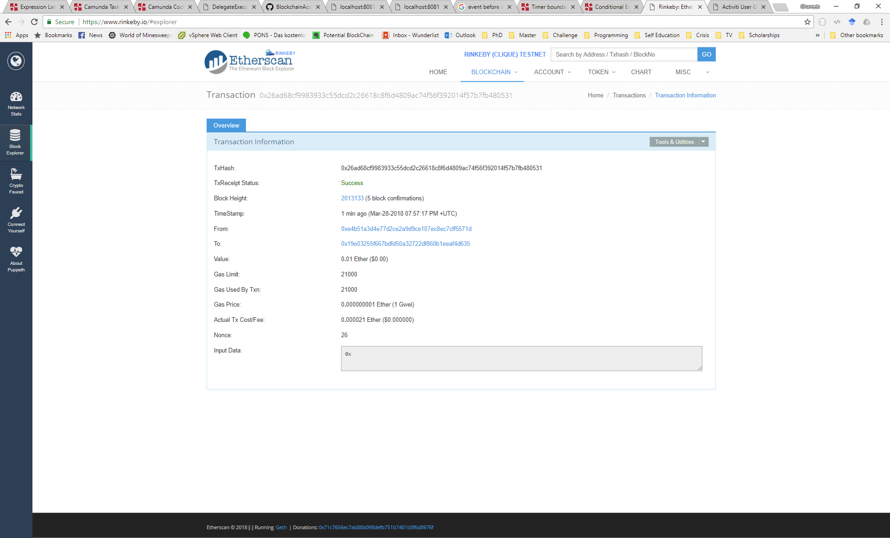

# Blockchain Access Layer
The project is a Java 8 web application that uses Jersey to expose a RESTful API.

## Configuration
The blockchain access layer needs to be able to communicate with a [geth node](https://github.com/ethereum/go-ethereum)
which enables RPC connections.
Furthermore, the layer directly accesses the keystore file holding the private key of an Ethereum account used for sending
and receiving transactions.
The configuration file that can be used to configure both aspects (communication with a geth node and the local keystore) can be found 
[here](src/main/resources/config.properties)


## Building and Deployment
After cloning, you can build the project and package it into a WAR
file using the following command:
```
mvn install
```
Then, the WAR file (which can be found in the folder 'target' generated after 
a successful build) can be deployed on an Apache Tomcat server.

## Accessing the API
The application exposes an asynchronous RESTful API to subscribe and unsubscribe from the provided operations.

**To summarize:**
The RESTful api provides the following resources/methods: 
* A POST method is provided for each of the following
paths to create the corresponding subscription:

```
{application-URL}/webapi/submit-transaction
{application-URL}/webapi/receive-transaction
{application-URL}/webapi/receive-transactions
{application-URL}/webapi/detect-orphaned-transaction
{application-URL}/webapi/ensure-transaction-state
```

* A GET method is also provided for the aforementioned URLs that lists the currently active subscriptions.

* A DELETE method is provided in each of the following
paths to manually delete the corresponding subscription:

```
{application-URL}/webapi/submit-transaction/{subscription-id}
{application-URL}/webapi/receive-transaction/{subscription-id}
{application-URL}/webapi/receive-transactions/{subscription-id}
{application-URL}/webapi/detect-orphaned-transaction/{subscription-id}
{application-URL}/webapi/ensure-transaction-state/{subscription-id}
```

## Running a Local geth Node
A geth node is used to access the Ethereum network. For development purposes, it is advised
not to connect to the main Ethereum network, but rather to one of the testnets.
(another, more difficult option would be to run a local private Ethereum network).
In order to connect a geth node to [Rinkeby](https://www.rinkeby.io) (one of Ethereum testnets), you can follow these steps:

1. [Install geth](https://github.com/ethereum/go-ethereum/wiki/Installing-Geth):
 this differs depending on your operating system.
2. Run geth in the fast-sync mode: This option downlaoads the whole blockchain but does not re-execute all transactions. Syncing
the whole testnet (which is done once only) blockchain takes about 1-4 hours (depending on the hardware, the speed of the network 
connection, and the availability of peers).
To start a geth node in the fast-sync mode, execute the following command:
```
geth --rpcapi personal,db,eth,net,web3 --rpc --rinkeby --cache=2048 --rpcport "8545"
--bootnodes=
enode://a24ac7c5484ef4ed0c5eb2d36620ba4e4aa13b8c84684e1b4aab0cebea2ae45cb4d375b77eab56516d34bfbd3c1a833fc51296ff084b770b94fb9028c4d25ccf@52.169.42.101:30303,
enode://343149e4feefa15d882d9fe4ac7d88f885bd05ebb735e547f12e12080a9fa07c8014ca6fd7f373123488102fe5e34111f8509cf0b7de3f5b44339c9f25e87cb8@52.3.158.184:30303,
enode://b6b28890b006743680c52e64e0d16db57f28124885595fa03a562be1d2bf0f3a1da297d56b13da25fb992888fd556d4c1a27b1f39d531bde7de1921c90061cc6@159.89.28.211:30303
```
If you want your node to be accessible remotely, apart from configuring your firewall, you also need to use the following extra option,
 when running the node:
```
--rpcaddr "0.0.0.0"
```
3. Test connection: you can test your connection to a running geth node using the following command
(make sure to install geth on the computer where you run this command):
```
geth attach http://localhost:8545
```
please replace _localhost_ with the ip address of the computer running the node.

## Case Study
The case study invloves a cryptocurrency exchange service utilitzing the blockchain access layer.
The exchange uses the following simplified BlockME-model:


Please follow these instructions:
1. Configure and run a local geth node (see above).
2. Configure the blockchain access layer to communicate with this node and to read a valid Ethereum keystore file (see above)
3. Build and deploy the blockchain access layer (see above).
4. Configure, build, deploy and initiate the process model ([see this Github repository for instructions](https://github.com/ghareeb-falazi/BlockME-UseCase))
5. Send ethers to the address maintained by the blockchain access layer (the first address of the keyfile mentioned in step 3).
6. Monitor the Tomcat server logs for both applications to see the progress. You can also use the 
Camunda Cockpit application (installed as part of step 4) to monitor the current state of instances of deployed process models.

The following series of screenshots show a sample execution of the case study:

 1. Initiating the process instance:
 
 
 2. Setting the source, and target addresses (exchange request parameters):
 
 
 3. Sending a transaction to the address of the crypto-exchange using the Ethereum Wallet application:
 
 
 4. The log records produced by the process instance. The final message in the log shows the id of the transaction
 the exchange sent to the client.
 
 
 5. [Rinkeby Explorer](https://www.rinkeby.io/#explorer) can be used to explore Rinkeby (Ethereum testnet) transactions and accounts.
 The following screenshot represents the result of querying the transaction id reported in the previous step:
 
 Please notice that the Explorer website does not always show the current state of the blockchain. The transaction in this case has actually
 received more than 12 block-confirmations whereas the Explorer reports only 5.
 
 When we performed this sample execution, the setup was as follows:
 
* a _geth_ node is running on a virtual machine in a VSphere accessible from the local network.
* The blockchain access layer is running in a local Tomcat server listening to port 8081
* The camunda engine is running in a local Tomcat server litening to port 8080